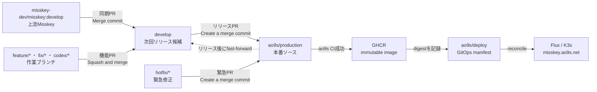

# ao9s.net Misskey forkのブランチ運用

この文書は、機能開発、上流Misskeyの取り込み、本番リリース、緊急修正で使用するブランチとマージ方法を定める。

## 全体像



## ブランチの責務

| ブランチ          | 寿命 | 責務                                    | 直接push                                 |
| ----------------- | ---- | --------------------------------------- | ---------------------------------------- |
| `develop`         | 常設 | 次回リリースに含める変更を統合する      | リリース後の安全なfast-forward以外は禁止 |
| `ao9s/production` | 常設 | 本番で稼働させるソースを保持する        | 禁止。必ずPull Requestを使用する         |
| `ao9s/deploy`     | 常設 | 本番imageのimmutable digestを保持する   | GitHub Actions以外は禁止                 |
| `feature/*`       | 短期 | 1つの新機能を実装する                   | 作業者のみ                               |
| `fix/*`           | 短期 | 本番緊急対応ではない不具合を修正する    | 作業者のみ                               |
| `hotfix/*`        | 短期 | 本番から分岐して緊急修正する            | 作業者のみ                               |
| `codex/*`         | 短期 | Codexが担当する1つの変更を実装する      | Codexの作業中のみ                        |
| `sync/upstream-*` | 短期 | 上流`develop`を取り込み、競合を解消する | 同期作業中のみ                           |

`master`は過去のfork同期で使用された古いブランチであり、新しい開発には使用しない。参照している設定や作業がないことを確認してから、別途削除する。

短期ブランチは用途のない空ブランチとして常設しない。Issueまたは具体的な作業が始まった時点で作成し、マージ後に削除する。

## 通常の機能開発

1. 最新の`develop`から`feature/<issue番号>-<概要>`、`fix/<issue番号>-<概要>`、または`codex/<概要>`を作成する。
2. 1ブランチには1つの論理変更だけを含める。
3. 実装、テスト、必要な生成物、`CHANGELOG.md`を同じブランチで完成させる。
4. 作業ブランチから`develop`へPull Requestを作成する。
5. 必須CIの成功と差分確認後、**Squash and merge**する。
6. マージ済みの短期ブランチを削除する。

未完成、検証中、または次回リリースへ含めない変更は`develop`へマージしない。`develop`は常に「次に本番へ出せる候補」とする。

## 本番リリース

1. `develop`から`ao9s/production`へPull Requestを作成する。
2. 差分、CHANGELOG、migration、rollback point、本番CIを確認する。
3. **Create a merge commit**でマージする。Squash and mergeとRebase and mergeは使用しない。
4. 本番CIとdeploy workflowの成功を確認する。
5. `ao9s/production`を`develop`へfast-forwardし、両ブランチを同じcommitへ戻す。

```powershell
git fetch --prune origin
git push origin refs/remotes/origin/ao9s/production:refs/heads/develop
```

このpushはfast-forwardでなければGitが拒否する。`--force`または`--force-with-lease`は使用しない。

## 緊急修正

1. 最新の`ao9s/production`から`hotfix/<issue番号>-<概要>`を作成する。
2. `hotfix/*`から`ao9s/production`へPull Requestを作成する。
3. 本番CIの成功後、**Create a merge commit**でマージする。
4. `develop`に未リリース変更がなければ、通常リリースと同様にfast-forwardする。
5. `develop`が先行している場合は、`ao9s/production`の修正を`develop`へ戻す専用Pull Requestを作成し、**Create a merge commit**で取り込む。

緊急修正をproductionだけに残したまま、次の通常リリースを行ってはならない。

## 上流Misskeyの取り込み

1. `misskey-dev/misskey`の`develop`を取得する。
2. 最新の自分たちの`develop`から`sync/upstream-YYYYMMDD`を作成する。
3. 上流`develop`をmergeし、競合とfork固有機能への影響を解消する。
4. `sync/upstream-*`から自分たちの`develop`へPull Requestを作成する。
5. upstreamのcommit ancestryを維持するため、**Create a merge commit**で取り込む。
6. 通常のリリース手順で`ao9s/production`へ反映する。

## GitHub設定

### `develop`

- ブランチを保護し、削除とforce-pushを禁止する。
- 通常変更はPull Requestを必須とする。
- リリース後の`ao9s/production`からのfast-forwardだけを管理者操作として許可する。
- linear historyは必須にしない。上流同期とhotfixの戻しにmerge commitを使用するためである。

### `ao9s/production`

- Pull Requestを必須とする。
- 必須checkの`lint-and-build`を維持する。
- 管理者を含め、削除とforce-pushを禁止する。
- `Require linear history`を解除し、リリース境界を示すmerge commitを許可する。

### Repository全体

- `Automatically delete head branches`は有効のままとする。
- 保護された`develop`は削除せず、マージ済みの短期ブランチだけを自動削除する。
- リリースPRではMerge commit、通常機能PRではSquash and mergeを選択する。

## 維持する不変条件

- `ao9s/production`のHEADは、本番へデプロイ可能な検証済みcommitである。
- 通常リリース直後は、`develop`と`ao9s/production`が同じcommitを指す。
- リリース間は、`develop`が未リリース変更の分だけ先行してよい。
- `ao9s/deploy`は、成功した本番buildのdigestだけを指す。
- 機能実装を`ao9s/production`または`ao9s/deploy`上で直接行わない。
- productionに入ったhotfixは、次の通常リリース前に必ず`develop`へ戻す。
